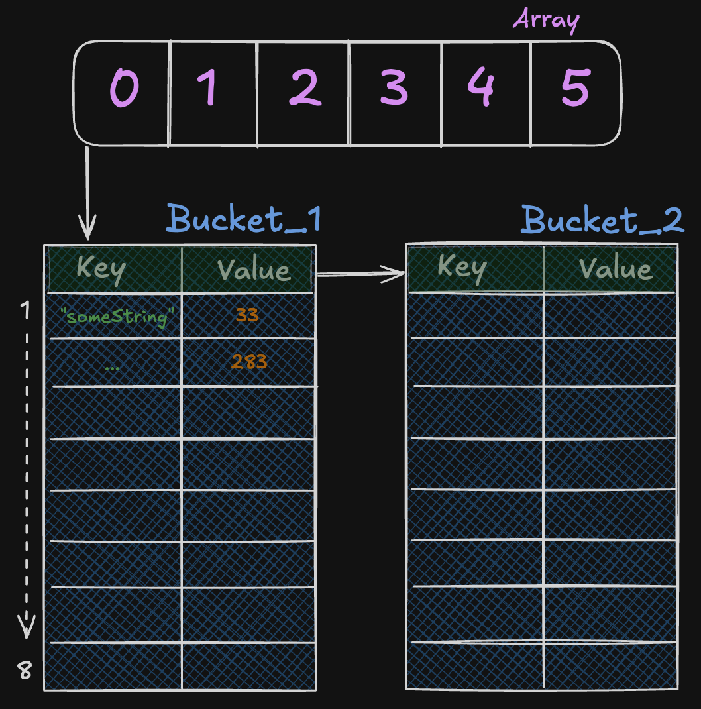

A Few Small
---
<!-- pause -->
```python +no_background

   █████████     ███████     █████             █████                       
  ███░░░░░███  ███░░░░░███  ░░███             ░░███                        
 ███     ░░░  ███     ░░███ ███████    ██████  ░███████    ██████    █████ 
░███         ░███      ░███░░░███░    ███░░███ ░███░░███  ░░░░░███  ███░░  
░███    █████░███      ░███  ░███    ░███ ░░░  ░███ ░███   ███████ ░░█████ 
░░███  ░░███ ░░███     ███   ░███ ███░███  ███ ░███ ░███  ███░░███  ░░░░███
 ░░█████████  ░░░███████░    ░░█████ ░░██████  ████ █████░░████████ ██████ 
  ░░░░░░░░░     ░░░░░░░       ░░░░░   ░░░░░░  ░░░░ ░░░░░  ░░░░░░░░ ░░░░░░  
```
<!-- pause -->
<!-- alignment: center -->
I learned from reading this book:

<!-- end_slide -->

<!-- alignment: center -->
 Memory and CPU Performance of Slices and Maps
---
<!-- alignment: left -->
## Initialisation Mistakes

---
<!-- alignment: center -->
<!-- column_layout: [1, 1] -->

<!-- pause -->
<!-- column: 0 -->
```go {all|1|2|4-6|8|all} +line_numbers
func getBar(foos []Foo) []Bar {
  bars := make([]Bar, 0) 

  for _, foo := range foos {
    bars = append(bars, fooToBar(foo))
  }

  return bars
}
```

<!-- pause -->
<!-- column: 1 -->

<!-- reset_layout -->

<!-- pause -->
A slice grows by doubling its backing array until it contains 1,024 elements, after which it grows by 25%.

<!-- pause -->
So from 0->1024 we get 11 new backing arrays
<!-- end_slide -->

<!-- alignment: center -->
 Memory and CPU Performance of Slices and Maps
---

<!-- 
speaker_note: |
  - Not just memory but performance (will get to that shortly)
-->

<!-- alignment: center -->
So what can we do about this?

---
<!-- pause -->

<!-- column_layout: [1, 1] -->

<!-- column: 0 -->
```go {all|2-3|all} +line_numbers
func convertGivenCapacity(foos []Foo) []Bar {
	n := len(foos)
	bars := make([]Bar, 0, n)

	for _, foo := range foos {
		bars = append(bars, fooToBar(foo))
	}
	return bars
}
```
<!-- pause -->

<!-- pause -->
<!-- column: 1 -->
```go {all|2-3|all} +line_numbers
func convertGivenLength(foos []Foo) []Bar {
  n := len(foos)
  bars := make([]Bar, n)

  for i, foo := range foos {
    bars[i] = fooToBar(foo)
  }
  return bars
}
```
<!-- pause -->

<!-- pause -->
<!-- 
speaker_note: |
  - Not just memory but performance (show benchmark)
  - Mention Maps
-->

<!-- reset_layout -->
Same with Maps:
```go
barMap := make(map[string]Bar, len(foos))
```
<!-- end_slide -->

<!-- alignment: center -->
 Memory and CPU Performance of Slices and Maps
---
<!-- alignment: left -->
## Deletion Mistakes
---
<!-- column_layout: [1, 1] -->
<!-- column: 0 -->
```go {all|2-3|5-7|9-13|all} +line_numbers 
func main() {
	n := 1_000_000
	m := make(map[int]Foo, n)

	for i := range n { // Adds 1 million elements
		m[i] = Foo{}
	}

	for i, foo := range m { // Deletes if foo is expired
    if foo.isExpired() {
			delete(m, i)
		}
	}
}
```
<!-- pause -->
<!-- column: 1 -->

<!-- end_slide -->
<!-- alignment: center -->
 Memory and CPU Performance of Slices and Maps
---
<!-- alignment: left -->
## Deletion Mistakes
---

<!-- end_slide -->
<!-- alignment: center -->
 Memory and CPU Performance of Slices and Maps
---
<!-- alignment: left -->
## Deletion Mistakes
---

<!-- end_slide -->
<!-- alignment: center -->
 Memory and CPU Performance of Slices and Maps
---
<!-- alignment: left -->
## Deletion Mistakes
---
```go {all|2-4|6-9|11-13|15-17|all} +line_numbers 
func main() {
	n := 1_000_000
	m := make(map[int][128]byte)
	printAlloc()

	for i := range n { // Adds 1 million elements
		m[i] = [128]byte{}
	}
	printAlloc()

	for i := range n { // Deletes 1 million elements
		delete(m, i)
	}

	runtime.GC() // Triggers a manual GC
	printAlloc()
	runtime.KeepAlive(m) // Keeps a reference to m so that the map isn’t collected
}
```
<!-- pause -->
<!-- alignment: center -->
After adding 1 million elements, there are 262,144 buckets.

<!-- end_slide -->
<!-- alignment: center -->
 Memory and CPU Performance of Slices and Maps
---
What can we do?

---
```go {all|3|all}+line_numbers
func main() {
	n := 1_000_000
	m := make(map[int]*[128]byte)
	printAlloc()

	for i := range n { // Adds 1 million elements
		m[i] = &[128]byte{}
	}
	printAlloc()

	for i := range n { // Deletes 1 million elements
		delete(m, i)
	}

	runtime.GC() // Triggers a manual GC
	printAlloc()
	runtime.KeepAlive(m) // Keeps a reference to m so that the map isn’t collected
}
```
<!-- pause  -->
It's the same with Slices:
```go +line_numbers
newSlice := someLargeSlice[:10] 
```
<!-- pause -->
<!-- end_slide -->
<!-- alignment: center -->
 Memory Leaks in Strings
---
<!-- alignment: left -->
## Iterating Over Strings

---
<!-- column_layout: [1, 1] -->

<!-- column: 0 -->
```go +line_numbers 
func concat(values []string) string {
	s := ""
	for _, value := range values {
		s += value
	}
	return s
}
```
<!-- pause -->
<!-- column: 1  -->

<!-- end_slide -->
<!-- reset_layout -->
<!-- alignment: center -->
 Memory and CPU Performance of Slices and Maps
---
What can we do?

---
<!-- column_layout: [1, 1] -->

<!-- column: 0 -->
```go {all|2|all} +line_numbers
func concat2(values []string) string {
	sb := strings.Builder{}
	for _, value := range values {
		_, _ = sb.WriteString(value)
	}
	return sb.String()
}
```
<!-- pause -->
<!-- column: 1 -->
```go {all|2-6|9|all} +line_numbers
func concat3(values []string) string {
	n := len(values)
	total := 0
	for i := range n {
		total += len(values[i])
	}

	sb := strings.Builder{}
	sb.Grow(total)
	for _, value := range values {
		_, _ = sb.WriteString(value)
	}
	return sb.String()
}
```

