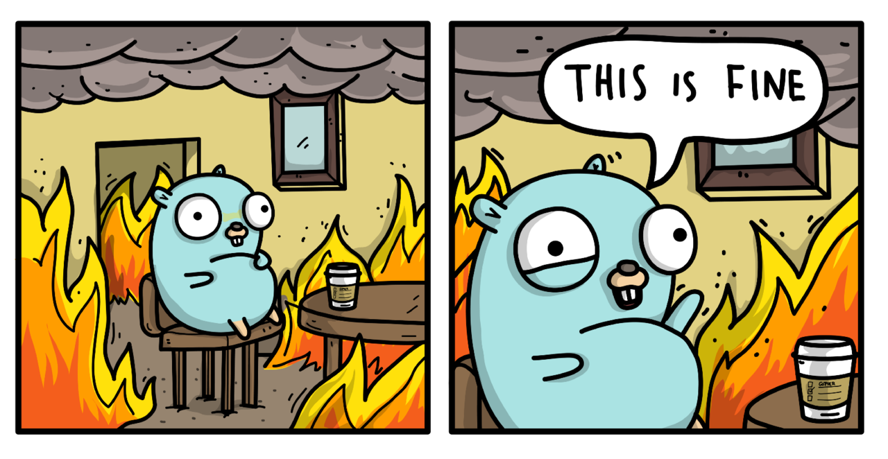

A Few Small
---
<!-- pause -->
```python +no_background

   █████████     ███████     █████             █████                       
  ███░░░░░███  ███░░░░░███  ░░███             ░░███                        
 ███     ░░░  ███     ░░███ ███████    ██████  ░███████    ██████    █████ 
░███         ░███      ░███░░░███░    ███░░███ ░███░░███  ░░░░░███  ███░░  
░███    █████░███      ░███  ░███    ░███ ░░░  ░███ ░███   ███████ ░░█████ 
░░███  ░░███ ░░███     ███   ░███ ███░███  ███ ░███ ░███  ███░░███  ░░░░███
 ░░█████████  ░░░███████░    ░░█████ ░░██████  ████ █████░░████████ ██████ 
  ░░░░░░░░░     ░░░░░░░       ░░░░░   ░░░░░░  ░░░░ ░░░░░  ░░░░░░░░ ░░░░░░  
```
<!-- pause -->
<!-- alignment: center -->
I learned from reading this book:

<!-- end_slide -->

<!-- alignment: center -->
 Memory and Performance of Slices and Maps
---
<!-- alignment: left -->
## Initialisation Errors

---
<!-- alignment: center -->
<!-- column_layout: [1, 1] -->

<!-- pause -->
<!-- column: 0 -->

<!-- column: 1 -->
```go {all|1|2|4-6|8|all} +line_numbers
func getBar(foos []Foo) []Bar {
  bars := make([]Bar, 0) 

  for _, foo := range foos {
    bars = append(bars, fooToBar(foo))
  }

  return bars
}
```

<!-- reset_layout -->
<!-- pause -->
A slice grows by doubling its backing array until it contains 1,024 elements, after which it grows by 25%.

<!-- pause -->
So from 0->1024 we get 11 new backing arrays
<!-- end_slide -->

<!-- alignment: center -->
 Memory and Performance of Slices and Maps
---

<!-- 
speaker_note: |
  - Not just memory but performance (will get to that shortly)
-->
<!-- alignment: center -->
So what can we do about this?

---
<!-- pause -->

<!-- column_layout: [1, 1] -->

<!-- column: 0 -->
```go {all|2|3|all} +line_numbers
func convertGivenCapacity(foos []Foo) []Bar {
	n := len(foos)
	bars := make([]Bar, 0, n)

	for _, foo := range foos {
		bars = append(bars, fooToBar(foo))
	}
	return bars
}
```
<!-- pause -->

<!-- pause -->
<!-- column: 1 -->
```go {all|2|3|all} +line_numbers
func convertGivenLength(foos []Foo) []Bar {
  n := len(foos)
  bars := make([]Bar, n)

  for i, foo := range foos {
    bars[i] = fooToBar(foo)
  }
  return bars
}
```
<!-- pause -->

<!-- pause -->
<!-- 
speaker_note: |
  - Not just memory but performance (show benchmark)
  - Mention Maps
-->

<!-- reset_layout -->
Same with Maps:
```go
barMap := make(map[string]Bar, len(foos))
```
<!-- end_slide -->

<!-- alignment: center -->
 Memory and Performance of Slices and Maps
---
<!-- alignment: left -->
## Deletion Errors
---

Maps under the hood:
  ```go
type hmap struct {
  // Note: the format of the hmap is also encoded in cmd/compile/internal/reflectdata/reflect.go.
  // Make sure this stays in sync with the compiler's definition.
  count     int // # live cells == size of map.  Must be first (used by len() builtin)
  flags     uint8
  B         uint8  // log_2 of # of buckets (can hold up to loadFactor * 2^B items)
  noverflow uint16 // approximate number of overflow buckets; see incrnoverflow for details
  hash0     uint32 // hash seed

  buckets    unsafe.Pointer // array of 2^B Buckets. may be nil if count==0.
  oldbuckets unsafe.Pointer // previous bucket array of half the size, non-nil only when growing
  nevacuate  uintptr        // progress counter for evacuation (buckets less than this have been evacuated)

  extra *mapextra // optional fields
  ```
